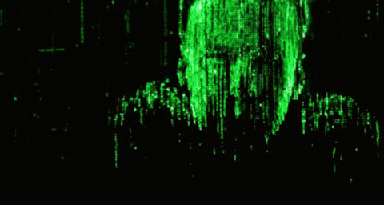

# yearPredictorIO 🧠🕳️

A Matrix-themed website that *predicts the next year*—not because it's useful, but because it's hilarious.

> "Same circus, new clowns incoming..."

## 🌀 Features
- Input the current year → Get the next year (wow)
- Brainrot + dark humor quotes
- Matrix background & glowing green text
- Loading delay to simulate intense computing

## 🔧 How to Run
1. Clone the repo or download files.
2. Make sure the file `assets/matrix.gif` exists (use your fav Matrix GIF).
3. Open `index.html` in a browser.
4. Laugh or cry.

## 🚀 Example
> Input: 2023  
> Output: 2024  
> Quote: *You thought it couldn’t get worse? LMAO.*

---

**Built with existential dread and caffeine.**
