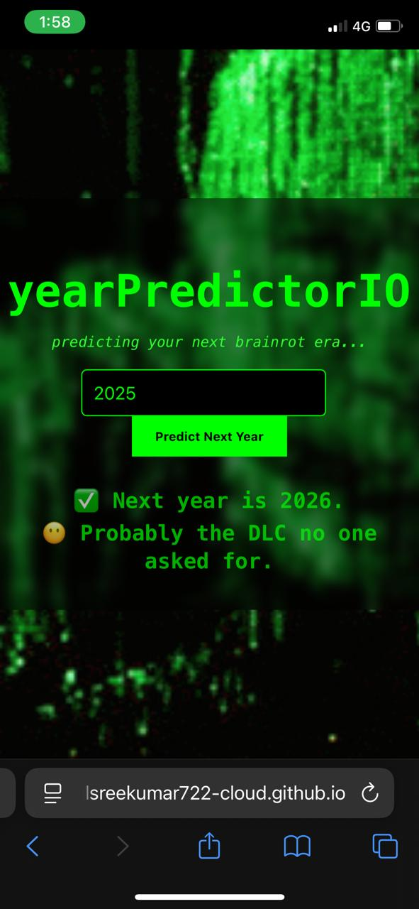

# yearPredictorIO

A Matrix-themed satirical web app that "predicts" the next year when you input the current year. Built with HTML, CSS, and JavaScript — infused with Gen-Z brainrot, dark humor, and a glitchy simulation vibe.

---

## 🔮 Features

- 🔢 Predicts next year (e.g., 2024 → 2025)
- 🧠 Gen-Z brainrot joke generator
- 🕶️ Matrix hacker aesthetic (blur, green text, animated bg)
- ⏳ Fake loading delay for dramatic effect
- 🔊 **Hidden audio transmission** playing in background...

---

## 📲 Screenshot

> This is how the site looks on mobile:

---

## 🚀 Getting Started

1. Clone or download the repository  
2. Ensure these files exist in `assets/`:  
   - `matrix-bg.gif`  
   - `ss.jpg`  
   - `hidden-message.mp3` ← (your Morpheus–Neo audio)  
3. Open `index.html` in your browser  
4. Click anywhere on screen to enable hidden audio  
5. Enter a year, receive the cursed prediction

---
## 🕵️‍♂️ Hidden Transmission

> 🎧 *There’s a voice in the code...*  
> If you listen closely, you may hear a message buried within.  
> A truth the system doesn't want you to realize.  
>  
> 🧩 Decode it.  
> 🕳️ Understand it.  
> 🫥 Then ask yourself...  
>  
> **"What *is* the Matrix?"**
